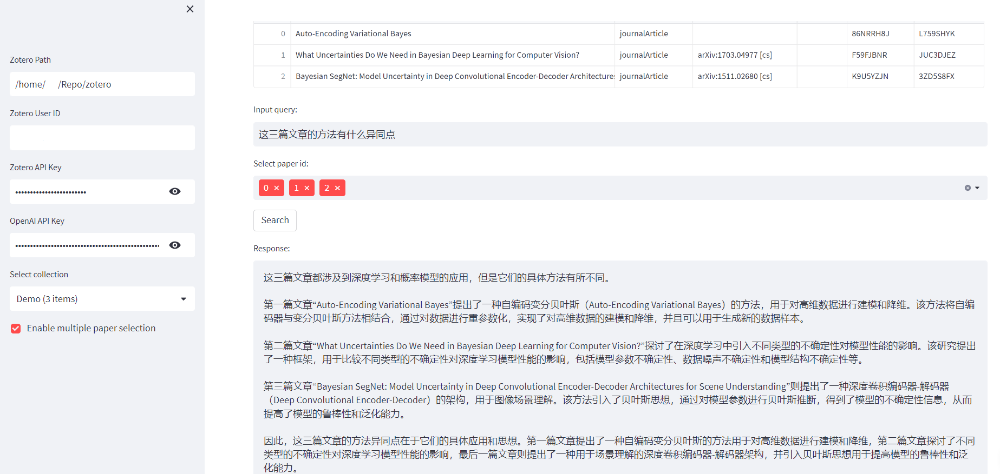

PaperGPT
========

PaperGPT 是一个使用 OpenAI GPT-3 进行科学论文问答的 Streamlit 应用。用户可以通过 PaperGPT 搜索他们的 Zotero 账户中的 PDF 文件，选择需要查看的文件，并通过提出问题进行问答。

[English doc](README.md)

如何使用
----

1.  安装依赖
    
    PaperGPT 使用 Streamlit 和 PyZotero，可以通过以下命令安装依赖：
    
    ```sh
    pip install streamlit pyzotero openai PyPDF2
    ```
    
2.  获取 API Key
    
    在使用 PaperGPT 前需要获取以下 API Key：
    
    *   Zotero API Key：用于从 Zotero 账户获取 PDF 元数据和 PDF 内容。
    *   OpenAI API Key：用于使用 OpenAI GPT-3 进行问答。
3.  运行 PaperGPT
    
    在终端输入以下命令启动 PaperGPT：
    
    ```sh
    streamlit run app.py
    ```
    
4.  配置 PaperGPT
    
    运行 PaperGPT 后会在浏览器中打开应用。在侧边栏中，填写以下信息：
    
    *   Zotero Path：本地 Zotero 库路径，例如 `/Users/XXX/Zotero`。
    *   Zotero User ID：Zotero 用户 ID。
    *   Zotero API Key：Zotero API Key。
    *   OpenAI API Key：OpenAI API Key。
5.  搜索 PDF 文件并提出问题
    
    *   在主界面中，选择要查询的 PDF 文件的集合。
    *   在输入框中输入问题。
    *   单击“搜索”按钮。
    *   选择要在其中搜索的 PDF 文件。
    *   以多选框的形式选择多个文件。
    *   单击“搜索”按钮，即可得到包含问题答案的详细摘要。

应用示例
----

以下示例展示了使用 PaperGPT 搜索 PDF 文件并提出问题的过程。

1.  在 Zotero 中创建一个包含若干 PDF 文件的集合。
    
2.  运行 PaperGPT，并填写必要的 API Key。
    
3.  在 PaperGPT 主界面中，选择包含 PDF 文件的集合。
    
4.  在输入框中输入问题，单击“搜索”按钮。
    
5.  在下方的多选框中选择要搜索的 PDF 文件。
    
6.  单击“搜索”按钮。
    
7.  得到包含问题答案的详细摘要。


    

注意事项
----

*   PaperGPT 只能搜索用户在 Zotero 中添加的 PDF 文件。
*   使用 OpenAI GPT-3 进行问答需要一定的时间。
*   如果 Zotero PDF 文件存储在 Dropbox 或其他云服务上，则无法搜索。

TODO
-----
*   使用数据库缓存查询结果，避免多次查询
*   优化用户交互界面，考虑前后端分离架构